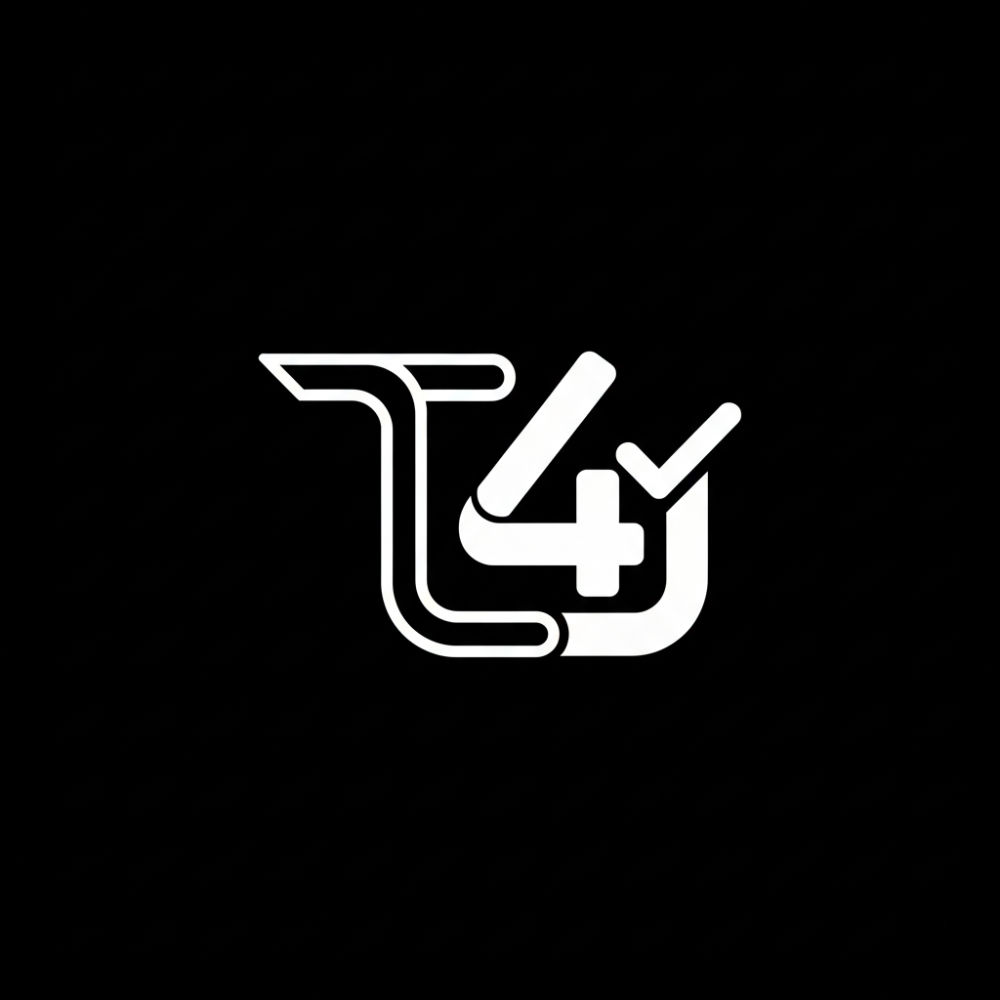

<div align="center">
  
  <h1>T4SYSTEMS — Webhook Sender</h1>
  <p>Une application web complète, premium et sans backend pour créer, gérer et envoyer des Webhooks Discord riches en toute sécurité.</p>
</div>

<br />

## 🌟 Fonctionnalités Principales

- **💡 100% Client-Side** : Aucune donnée ne transite par un serveur tiers. La sauvegarde se fait dans le navigateur local (`localStorage`), assurant une confidentialité totale.
- **🎨 Design Premium (Glassmorphism)** : Interface utilisateur moderne et dynamique gérée en CSS natif. Accompagnée d'effets visuels attrayants et de micro-animations interactives.
- **🌗 Support Multi-Thèmes** : Mode Clair (Light) et Mode Sombre (Dark) entièrement fluides, avec ajustement intelligent du logo T4SYSTEMS.
- **🛠️ Configurations centralisées** : Gestion claire des URLs de Webhooks sans configuration préalable nécessaire.
- **📦 Chargement de Fichiers Locaux** : Support natif et intuitif pour intégrer directement des images locales dans vos embeds Discord via l'API `multipart/form-data`.
- **💾 Import / Export JSON** : Sauvegardez et restaurez vos brouillons, templates d'embeds et configurations de Webhooks via un simple fichier de configuration en un clic.

---

## 🚀 Installation & Utilisation

Puisque le logiciel est statique et tourne uniquement dans votre navigateur Web, aucune installation compliquée n'est demandée !

1. **Clonez le dépôt** sur votre machine locale ou téléchargez-le en '.zip' :
   ```bash
   git clone https://github.com/votre_profil/t4systems-webhook.git
   ```
2. **Ouvrez le dossier** `T4SYSTEMS - Webhook Discord`.
3. Lancez simplement le fichier **`index.html`** dans un navigateur récent (Chrome, Firefox, Safari, Edge).

### 📖 Flux d'Utilisation Recommandé :
- Naviguez d'abord vers la page **"Configuration"**.
- Ajoutez l'URL de votre Webhook Discord générée dans les paramètres de votre serveur.
- Naviguez ensuite vers l'onglet **"Messages & Embeds"** pour composer un aperçu visuel de l'annonce, l'enregistrer comme template, ou l'émettre directement vers votre serveur Discord.

---

## 📦 Architecture du projet

Le projet est basé sur du code vanilla pur pour éviter l'encombrement des frameworks JavaScript lourds.

- `index.html` : Point d'entrée de l'application et du menu principal.
- `pages/config.html` : L'interface de configuration, de sauvegarde et de restauration JSON.
- `pages/message.html` : L'éditeur complet de création d'embeds contenant des sections avancées.
- `assets/styles/shared.css` : Contient toute l'esthétique premium de "Glassmorphism" et la gestion des thèmes.
- `assets/images/` : Contient le logo-light et logo-dark affichés sur le Header.

---

## 🎨 Personnalisation (UI / Thèmes)

L'UI a été conçue pour être modifiable simplement :
- Vous pouvez définir vos couleurs custom dans `assets/styles/shared.css` en accédant aux variables CSS (`:root` et `html[data-theme="dark"]`).
- Pour remplacer le formatage des Embed, vous pouvez éditer le constructeur JSON dans `message.html` (ligne `async () => { ... }`).

### Remplacement de ロゴ (Logo)
Placez un nouveau fichier SVG ou PNG dans `assets/images/` qui prendra pour nom `logo-dark.png` ou `logo-light.png` si vous souhaitez le modifier.

---

## ⚠️ Sécurité

**Vos Webhooks offrent un accès administratif pour envoyer des messages sur votre serveur Discord.**  
Ne partagez pas vos fichiers de sauvegarde JSON (`t4systems-backup.json`) avec d'autres personnes et veillez à ne jamais rendre ce projet hébergé et public sur un service d'hôte de page qui listerait vos webhooks dans l'explorateur du navigateur.
